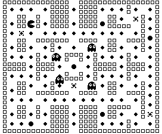

# 計算機概論 112-1 Final Project

## PAC-MAN

用 jack language 復刻 PAC-MAN 遊戲

## 使用方式

用 `VMEmulator` 讀入整個 `VM file` 資料夾

將速度調至最快，animate 設成 `no animation`，view 設成 `Screen`，按下 `Run` 即可開始遊玩

## 遊玩方式

玩家會不斷向前移動，你的任務是控制玩家  的移動方向

使用 `W` `A` `S` `D` 控制玩家的上左下右

玩家只有在該轉向合理(轉向後會繼續移動)才會進行轉向

當接觸到道具時就會吃下該道具

一個小的四邊形  是小的分數點

一個大的八角型  是大的分數點

一個四芒星  是特殊的道具

大的分數點為 `50` 分，小的分數點為 `10` 分

特殊的四芒星道具可使鬼進入受驚嚇(虛弱)的狀態  一段時間

玩家於鬼在該狀態下與鬼接觸，鬼會進入死亡狀態，回到鬼的重生處重新出發

你的任務是吃完場上所有的分數點，總計得到 `1340` 分

當你在過程中碰到正常狀態下的鬼  ，則遊戲失敗

當然，碰到虛弱或死亡狀態的鬼並不會結束遊戲

## 地圖介紹

中心為鬼的重生處，鬼由此處開始行動

牆壁是你最好的掩體，善用牆壁與鬼迂迴，可大幅度提高獲勝機率

上下開放的管道是互相連通的，可以經由此管道快速前往地圖的另一端

## END

其他彩蛋等你來發掘，趕緊下載來玩吧
